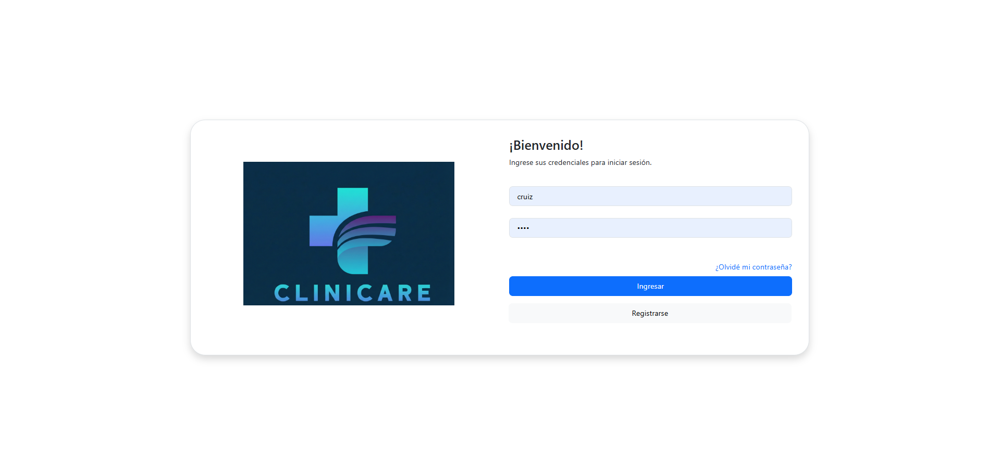
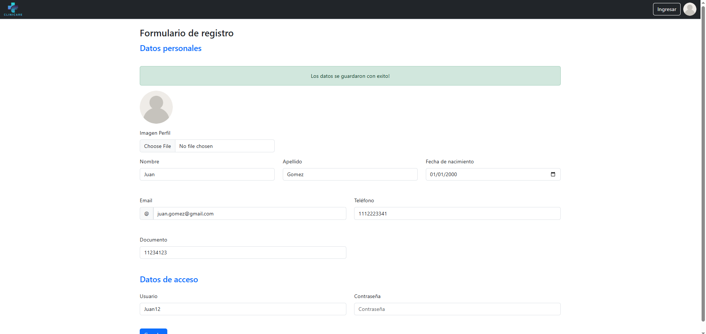
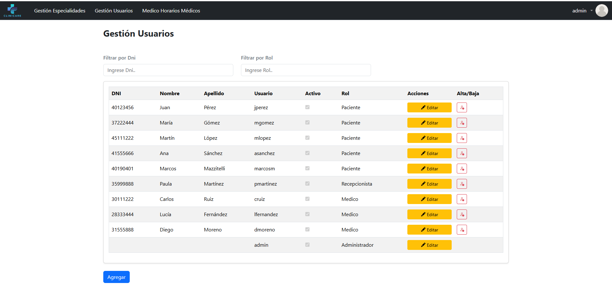
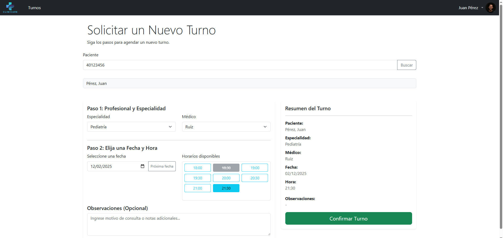
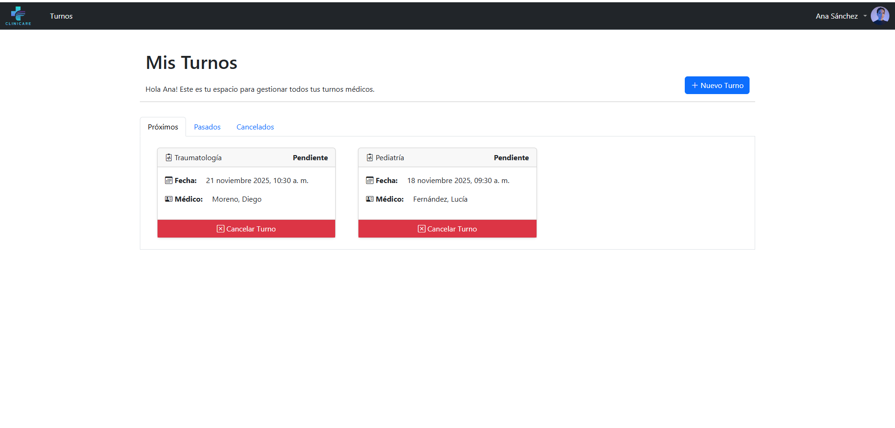
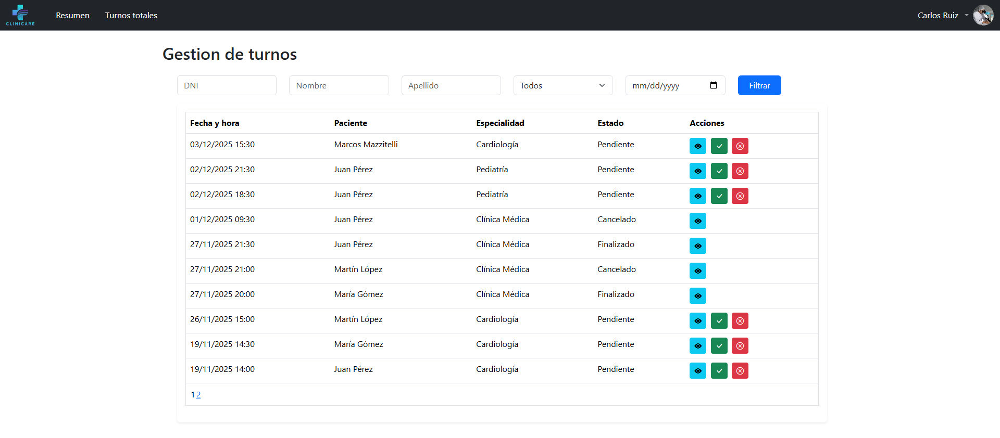
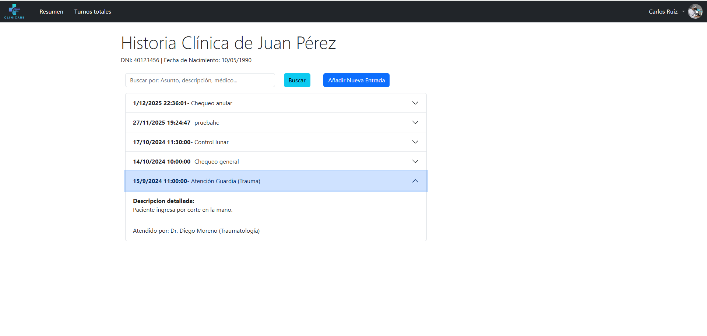
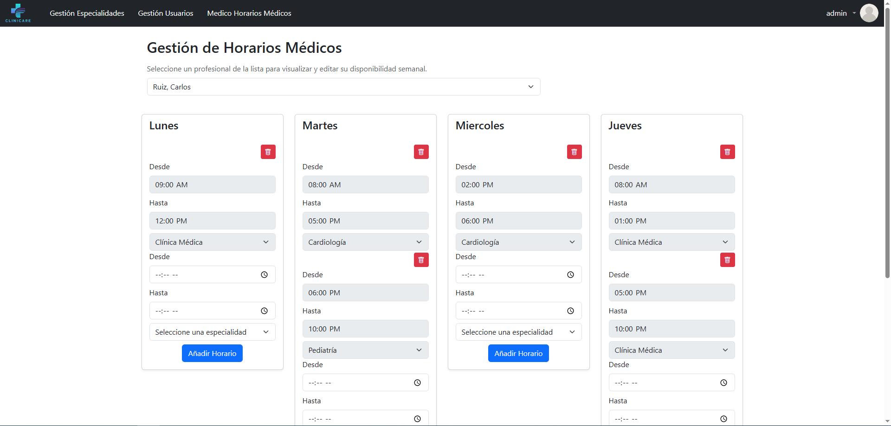
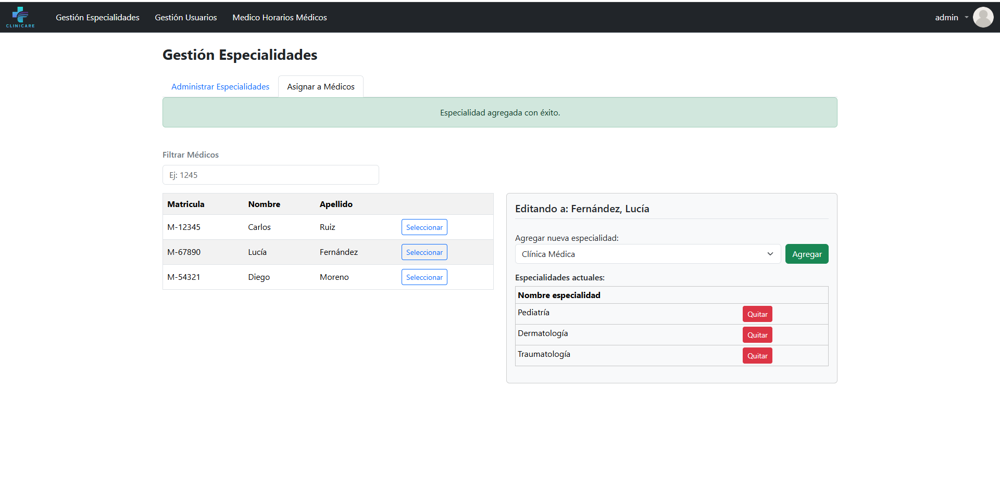

# Sistema de Gestión de Clínica Web
 

## Descripción

Aplicación web para la gestión integral de una clínica médica, desarrollada como trabajo final de segundo año de la Tecnicatura Universitaria en Programación (Equipo 5A).

El sistema resuelve la problemática de la administración de turnos, permitiendo la interacción entre tres actores principales: pacientes (autogestión), médicos (evolución clínica) y recepcionistas (administración), con un módulo de administración para la configuración de la clínica.

## Tecnologías utilizadas:

- Backend: ASP.NET 4.8.1 Webforms (C#)

- Base de Datos: SQL Server.

- Frontend: ASP.NET Controls, HTML5, CSS3, Bootstrap.

- Control de Versiones: Git / GitHub.

- Servicio de Email automatizado (SMTP) para confirmación de turnos y registro.

## Arquitectura y Diseño:

El proyecto fue desarrollado siguiendo una Arquitectura en Capas para garantizar la escalabilidad, el mantenimiento y la separación de responsabilidades:

1. Capa de Dominio: Entidades y modelos de objetos compartidos entre capas.

2. Capa de Datos: Acceso a base de datos y ejecución de querys.

3. Capa de Negocio: Reglas de negocio, validaciones lógicas y llamados a listados de la capa de Datos.

4. Capa de Presentación: Interfaces web y lógica de controles.

## Calidad de Software:

**- Manejo de Errores:** Implementación robusta de bloques try-catch y gestión de excepciones personalizadas para evitar fallos críticos en tiempo de ejecución.

**- Validaciones:** Doble capa de validación (Frontend y Backend) para asegurar la integridad de los datos ingresados antes de interactuar con la base de datos.

## Módulos y Funcionalidad:

El sistema implementa una arquitectura basada en roles con las siguientes características:

### 1. Pacientes

- Autogestión de Turnos: Solicitud de turnos validando disponibilidad en tiempo real.

- Historial: Visualización de turnos en pestañas (Próximos, Pasados, Cancelados).

- Perfil: Edición de datos personales y de contacto.

### 2. Médicos

- Dashboard Diario: Visualización rápida de la agenda del día con contadores de estado (Pendientes, Atendidos, Cancelados, etc.).

- Gestión de Atención:

  - Acciones rápidas para cambiar estado del turno.

  - Carga y visualización de Historia Clínica asociada al paciente.

- Reportes: Listado histórico con filtros múltiples (DNI, Estado, Fechas).

### 3. Recepcionistas

- Gestión Operativa: Grid principal con filtrado dinámico.

- Lógica de Negocio:

  - Reprogramación Inteligente: Al mover un turno, el sistema valida automáticamente la grilla horaria del médico y conflictos con otros turnos.

  - Alta de pacientes y usuarios simultánea.

- Asignación Manual: Carga de turnos presenciales o telefónicos.

### 4. Administrador

- ABM de Usuarios: Gestión centralizada de perfiles y permisos.

- Maestro de Especialidades: Alta de especialidades médicas.

- Gestión de Horarios:

  - Configuración de rangos horarios por día y médico.

  - Validaciones de Integridad: Control de solapamientos horarios, validación de hora entrada < salida, y bloqueo de eliminación de horarios si existen turnos futuros asociados.

## Capturas de Pantalla

### Login

### Formulario de Registro

### Gestión de Usuarios

### Gestión de Turnos

### Panel Médico

### Ver historias clínicas

### Gestión de Horarios

### Asignacion de especialidades

 

## Instalación Local

**1) Clonar el repositorio:**

       git clone https://github.com/MarcosMazzitelli/TPI-CliniCare-Equipo-5A.git

**2) Base de Datos:**
   * Dirigirse a la carpeta /DatabaseScripts.

   * Ejecutar los scripts en el siguiente orden en SQL Server Management Studio (SSMS) o el cliente que desee utilizar:

     1. &nbsp;  00 Creacion DB.sql (Crea la estructura de tablas y SPs).

     2. &nbsp; 01 Registro de datos.sql (Pobla las tablas maestras y usuarios iniciales).

   * **Nota:** Existe un script 02 Limpieza de registros.sql útil para entornos de prueba, ya que resetea los datos y los contadores de identidad.

**2) Configuración de Conexión:**

* Abrir la solución .sln en Visual Studio.

* Ir al proyecto de capa de datos (Datos), archivo AccesoDatos.cs.

* En el constructor, actualizar la cadena de conexión según tu instancia local:

      // Datos/AccesoDatos.cs
       public AccesoDatos()
      {
            // Modificar "server=.\\SQLEXPRESS" si tu instancia tiene otro nombre
            conexion = new SqlConnection("server=.\\SQLEXPRESS;         
            database=CLINICA_DB; integrated security=true");
            comando = new SqlCommand();
      }

**4) Ejecución:**

* Establecer el proyecto Web como proyecto de inicio (Formulario **Login.aspx**).

* Compilar y ejecutar con IIS Express.

## Autores (Equipo 5A)

* Bernardo Jerez.

* Julieta Macarena Sánchez.

* Marcos Mazzitelli.

#### 2025 - Trabajo Práctico Universitario - Tecnicatura Universitaria en Programación.
